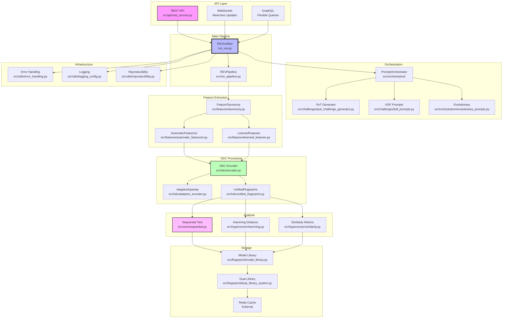
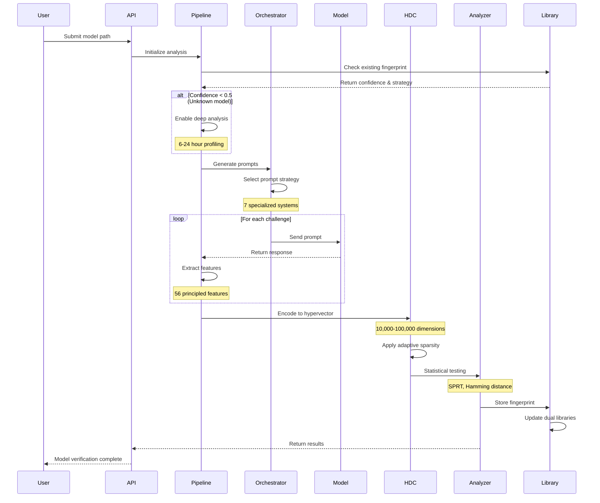
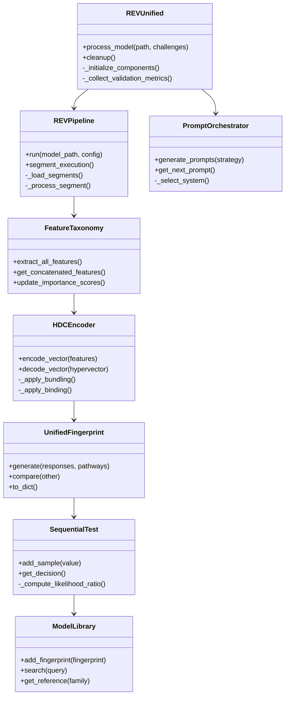
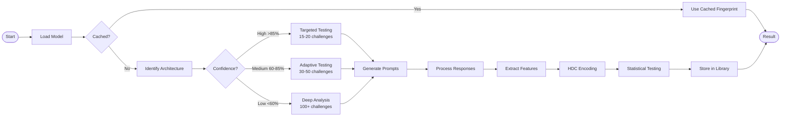
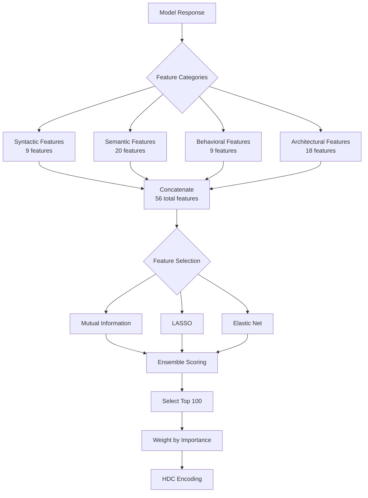
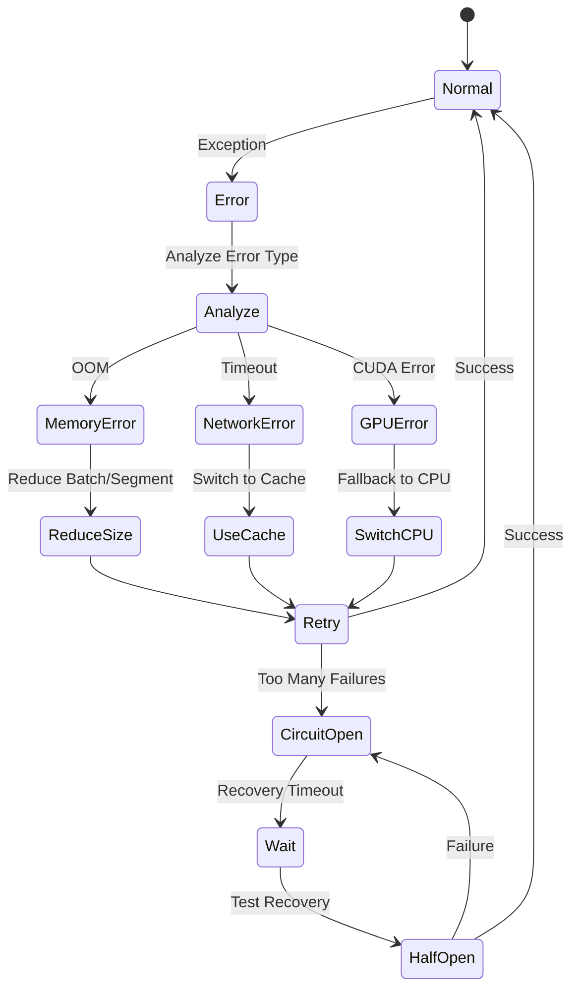
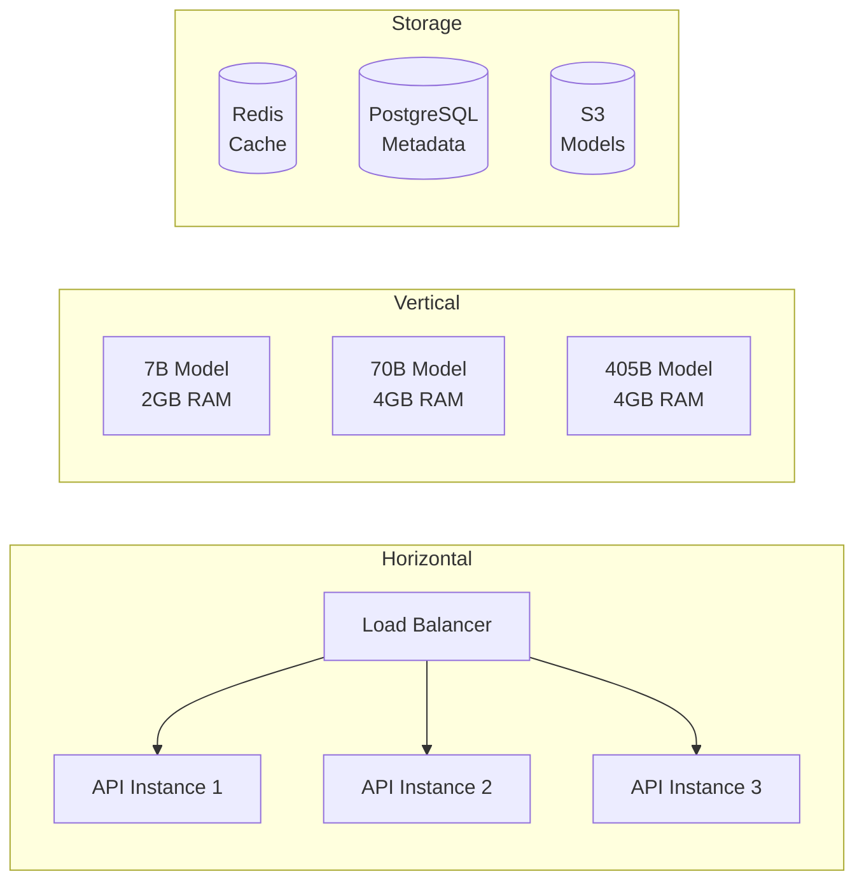
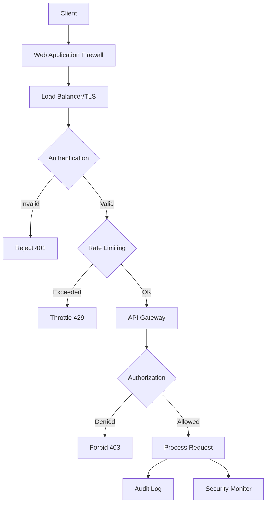
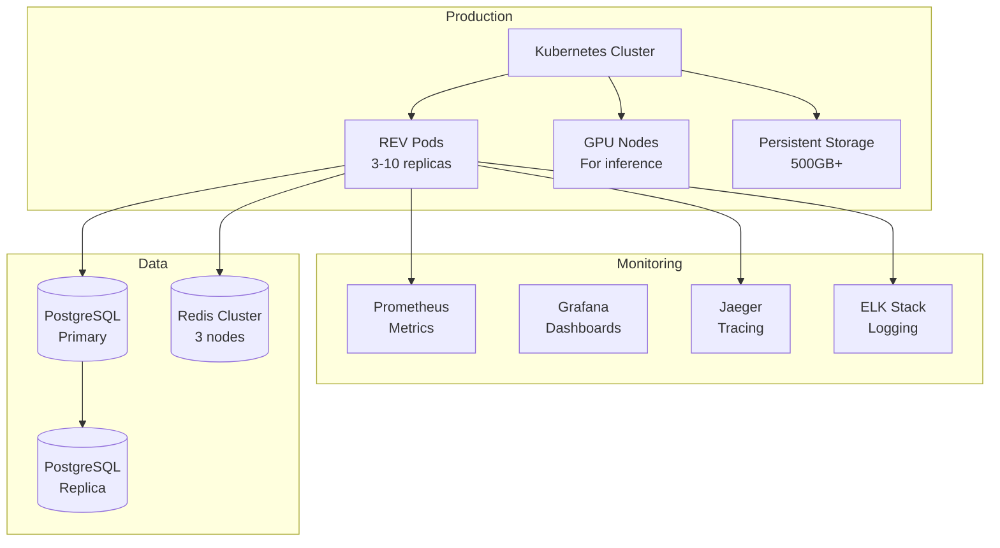

# REV System Architecture

## Table of Contents
- [Overview](#overview)
- [Module Dependency Graph](#module-dependency-graph)
- [Data Flow Pipeline](#data-flow-pipeline)
- [Class Hierarchy](#class-hierarchy)
- [Key Workflows](#key-workflows)
- [Component Details](#component-details)

## Overview

The REV (Restriction Enzyme Verification) System implements a novel approach to LLM verification through biological-inspired restriction site analysis. The architecture consists of five main layers:

1. **API Layer**: REST/WebSocket/GraphQL interfaces
2. **Orchestration Layer**: Prompt generation and strategy management
3. **Processing Layer**: Model inference and fingerprint extraction
4. **Analysis Layer**: Statistical testing and verification
5. **Storage Layer**: Dual library system and caching

## Module Dependency Graph



## Data Flow Pipeline



## Class Hierarchy



## Key Workflows

### 1. Model Analysis Workflow



### 2. Feature Extraction Workflow



### 3. Error Recovery Workflow



## Component Details

### 1. Restriction Sites (Biological Metaphor)

The core innovation maps LLM layers to restriction enzymes:

```python
# Restriction Site = High behavioral divergence point
RestrictionSite:
  - layer_idx: int          # Layer number (0-based)
  - divergence: float        # Behavioral divergence score [0,1]
  - confidence: float        # Statistical confidence [0,1]
  - site_type: str          # "attention", "mlp", "norm"
```

### 2. Hyperdimensional Computing (HDC)

Encodes features into high-dimensional binary vectors:

```python
# HDC Operations
Bundling: XOR operation for combining vectors
Binding: Rotation for associating vectors
Similarity: Hamming distance for comparison

Dimensions: 10,000 - 100,000
Sparsity: 0.5% - 15% (adaptive)
```

### 3. Sequential Testing (SPRT)

Implements Wald's Sequential Probability Ratio Test:

```python
# SPRT Parameters
α = 0.05  # Type I error (false positive)
β = 0.05  # Type II error (false negative)
θ₀ = 0.5  # Null hypothesis
θ₁ = 0.7  # Alternative hypothesis

# Decision boundaries
A = (1-β)/α     # Upper boundary (accept H₁)
B = β/(1-α)     # Lower boundary (accept H₀)
```

### 4. Dual Library System

Maintains two fingerprint libraries:

```python
Reference Library:
  - Location: fingerprint_library/reference_library.json
  - Purpose: Deep behavioral baseline
  - Updates: Rare (new families only)
  - Size: ~100 reference models

Active Library:
  - Location: fingerprint_library/active_library.json  
  - Purpose: Continuous learning
  - Updates: Every successful run
  - Size: Unlimited (auto-pruned)
```

### 5. Prompt Orchestration

Seven specialized prompt generation systems:

| System | Weight | Focus | Prompts/Min |
|--------|--------|-------|------------|
| PoT | 30% | Behavioral boundaries | 10 |
| KDF | 20% | Security/adversarial | 5 |
| Evolutionary | 20% | Genetic optimization | 3 |
| Dynamic | 20% | Template synthesis | 15 |
| Hierarchical | 10% | Taxonomical | 8 |
| Predictor | - | Effectiveness scoring | - |
| Profiler | - | Pattern analysis | - |

### 6. Memory Management

Segmented execution for massive models:

```python
Segment Execution:
  - Load one layer at a time
  - Process at attention boundaries  
  - Memory cap: 2-4GB per segment
  - Supports 405B+ parameter models
  
Memory Recovery:
  - Automatic GPU cache clearing
  - Dynamic segment size adjustment
  - CPU fallback on GPU OOM
  - Checkpoint-based resumption
```

## Performance Characteristics

| Component | Latency | Memory | GPU Required |
|-----------|---------|--------|--------------|
| Feature Extraction | <100ms | 100MB | No |
| HDC Encoding | <50ms | 500MB | No |
| SPRT Testing | <10ms | 10MB | No |
| Hamming Distance | <1ms | 50MB | No |
| Deep Analysis | 6-24h | 2-4GB | Yes |
| API Response | <500ms | 200MB | No |

## Scalability

The system scales across multiple dimensions:



## Security Architecture



## Deployment Architecture



---

This architecture enables REV to verify models 15-20x faster than traditional methods while maintaining cryptographic integrity through Merkle trees and supporting models that exceed available memory.